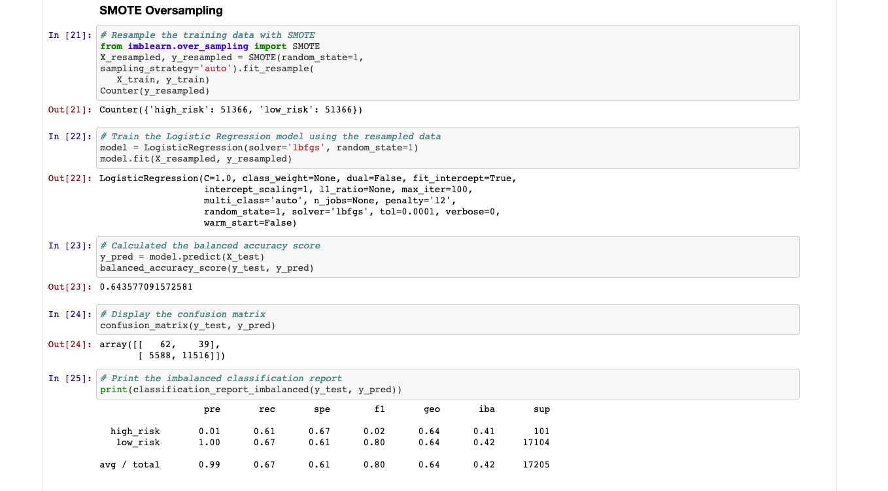
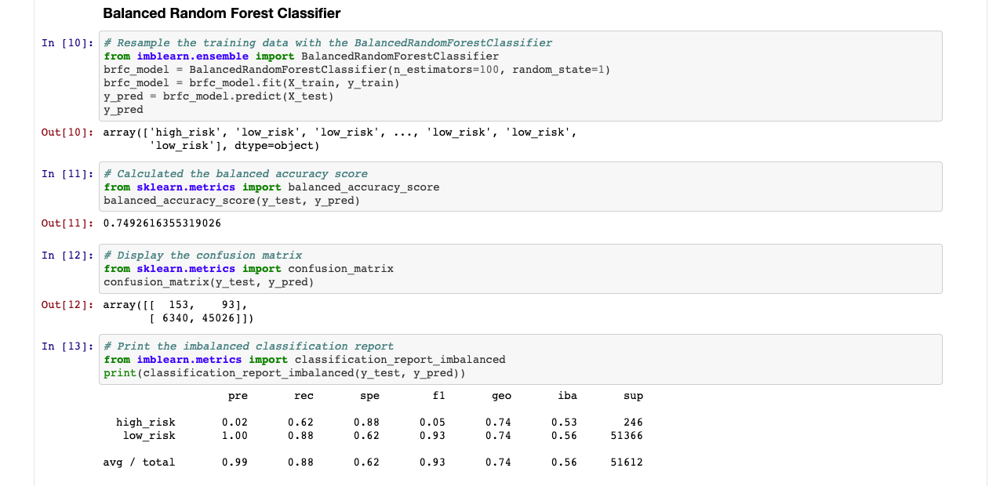

# Credit_Risk_Analysis

## Overview

### Purpose
The purpose of this analysis is to apply machine learning to solve credit card risk issue. Credit risk is an inherently unbalanced classification problem, as good loans easily outnumber risky loans. It is necessary to employ different techniques to train and evaluate models with unbalanced classes. In this analysis there will be imbalanced-learn and scikit-learn libraries to build and evaluate models using resampling.

Using the credit card credit dataset from LendingClub, a peer-to-peer lending services company, we will oversample the data using the RandomOverSampler and SMOTE algorithms, and undersample the data using the ClusterCentroids algorithm. Then, we'll use a combinatorial approach of over- and undersampling using the SMOTEENN algorithm. Next, we'll compare two new machine learning models that reduce bias, BalancedRandomForestClassifier and EasyEnsembleClassifier, to predict credit risk. Lastly, we will evaluate the performance of these models and make a written recommendation on whether they should be used to predict credit risk.

### Results

Precision = TruePositives / (TruePositives + FalsePositives)
#### Random Over Sampler

- Accuracy: 0.6579
- Precision: 0.01049

#### SMOTE

- Accuracy: 0.6436
- Precision: 0.01097

#### Cluster Centroids

- Accuracy: 0.5443
- Precision: 0.0068

#### SMOTEENN

- Accuracy: 0.6584
- Precision: 0.0099

#### Balanced Random Forest Classifier

- Accuracy: 0.7493
- Precision: 0.0236

#### Easy Ensemble Classifier

- Accuracy: 0.8230
- Precision: 0.0318

Comparing to all of the machine learning models Easy Ensemble Classifier was more accurate and precise and the least accurate and precise was Cluster Centroids.

### Summary

After analyzing all six machine learning models. The most accurate and precise model was Easy Ensemble Classifier and the least accurate and precise was Cluster Centroids. In ranking from most accurate and precise to least: Easy Ensemble Classifier, Balanced Random Forest Classifier, Random Tower Sampler, SMOTE, SMOTEENN, and Cluster Centroids(least). From this it can be said that the machine learning models that reduce bias is more reliable in comparing to over sampling, under sampling, and a mix of both. After this analysis we can reccomend to use Easy Ensemble Classifier to predict credit risk. 

